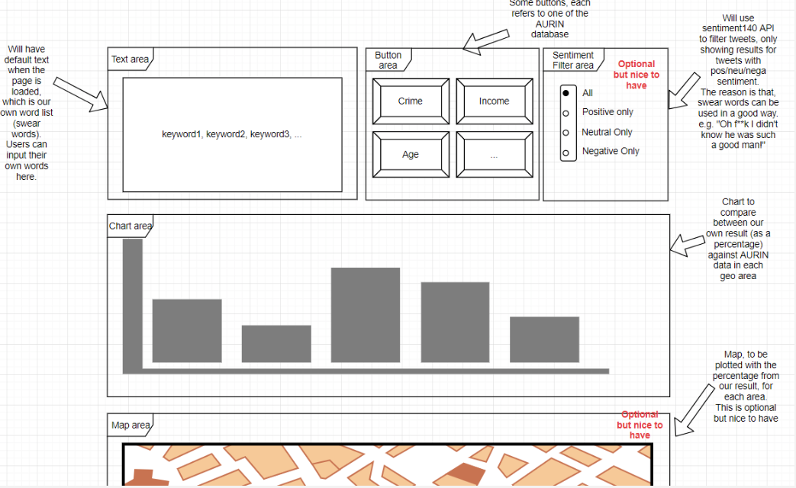

# System Requirements

## Snapshot

# Usage of Web Application
## Step1: Query the "swear areas"
Input 5 keywords in the searching window, query the percentage of tweets of areas based on keywords (swear words). The default words are "".

## Step2: Query the AURIN data
click button to get data from corresponding AURIN dataset. The buttons are "Violence Crime", "Income", "Age".

# Response to Query

## Chart Area
Display the top 10 swear areas, i.e., the 10 areas where the percentage of swearing tweets is the highest. By side, display the data of AURIN data queried of corresponding area.

## Map Area
Display the swearing areas in the form of heat map.
